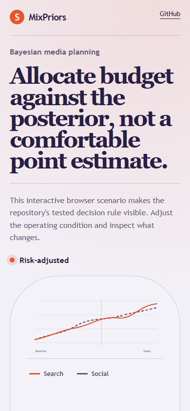

# mixpriors

> A Bayesian media mix model whose budget optimiser maximises expected return under the posterior, not under a point estimate.

## Live deployment

[](https://github.com/SlateGitOrg/mixpriors/actions/workflows/ci.yml)

[Open the interactive MixPriors demo](https://slategitorg.github.io/mixpriors/)

The deployed interface uses a deterministic offline scenario to make the repository's tested decision rule visible without external services or private data.

### Desktop


### Mobile



`FLAGSHIP` · **Marketing Analyst** · Expert · ~6 weeks · Insurance - direct-to-consumer acquisition

**Primary language:** Python
**Tags:** `bayesian`, `mmm`, `numpyro`, `optimisation`, `priors`, `marketing-science`

---

## The problem

A CMO must split 40M across nine channels. Weekly aggregate data gives roughly 150 observations to estimate nine channel effects plus seasonality and price. An unconstrained model will happily report that radio has a negative effect and out-of-home returns 14x - both noise - and the budget moves accordingly, which is how a measurement error becomes a real financial loss.

## ⭐ The differentiator

**Informative priors on adstock and saturation, with posterior uncertainty carried through into the budget optimiser.** The recommendation is the allocation maximising expected return *under the posterior*, with a stated risk band - not the allocation maximising a point estimate. Priors are calibrated against geo-lift results where available, closing the loop between experiment and model. A generic MMM fits OLS with ad-hoc adstock and produces a confidently wrong allocation with no uncertainty at all.

This is the sentence to lead with when someone asks you to walk through the
project. Everything else in this repo exists to make it true and to prove it.

## Data

A documented synthetic generator with **known true response curves** per channel, realistic inter-channel collinearity and seasonality, enabling direct parameter recovery testing. Supplemented by openly released MMM example datasets for structural realism.

> No paid API key is required to run or demo this project. Where a paid
> service would add value it is wired as an optional enhancement behind an
> interface with an offline mock as the default implementation.

## Stack

- Python: NumPyro / PyMC on JAX
- DuckDB, Plotly, Quarto
- Docker, pytest

## Core capabilities

- Adstock (geometric and Weibull) and saturation (Hill) transforms with parameter priors
- Hierarchical structure pooling across regions or products to stabilise weak channels
- Prior-predictive and posterior-predictive checks as gating steps, not appendices
- Budget optimiser maximising expected response subject to channel minimum and maximum constraints
- Calibration hooks ingesting geo-experiment results as priors

## Repository layout

```
src/transforms/
src/model/
src/optimise/
generator/
checks/
test/recovery/
```

## Build plan

1. Generator with true response curves. Parameter recovery is the only honest way to evaluate an MMM.
2. Transforms and priors. Spend real time on prior choice and document the reasoning - it is the interview.
3. Prior predictive checks before fitting. Fitting first and checking later is how bad priors survive.
4. Optimiser last, and make it consume the posterior rather than the mean.

## Testing strategy

**Parameter recovery tests**: assert true adstock and saturation values fall inside their posterior credible intervals at nominal rates across many simulated datasets. Assert the optimiser's allocation beats the incumbent allocation **on the generator's true response surface** - not on the fitted one, which would be circular.

Tests assert **correctness**, not merely that the code runs. A green suite on
this repo is a claim about behaviour under adversarial conditions; treat any
test that would pass against a deliberately broken implementation as a bug in
the test.

## Quality & safety layer

The model reports which channels it cannot distinguish rather than assigning them arbitrary split credit. Posterior-predictive failure blocks publication of an allocation.

## Measurable outcome

> Reallocating 18% of budget raises modelled acquisitions 11% at flat spend, with a 90% credible interval of +6% to +15% - and the model states plainly which two channels it cannot tell apart.

State it in these terms — business units, not technical ones — in your CV
bullet and in the first thirty seconds of describing the project.

## Interview questions this project answers

- **Why does MMM need priors?**
- **How do you validate an MMM when you have no ground truth?**
- **What is adstock, and how did you choose its prior?**

## What this deliberately is *not*

- Not a replacement for experiments - it consumes them as priors.
- Not a black box: every prior is documented with its justification.


## Run it now

```bash
python -m unittest discover -s tests -v   # the suite
python -m src.demo                        # the 60-second artefact
```

Requires Python 3.11+. The runnable core uses **only the standard
library** (including `sqlite3`), so there is nothing to install.

## Getting started

```bash
git clone <your-fork-url> mixpriors
cd mixpriors
pip install -e .
python -m generator --weeks 156 --channels 9
python -m checks prior_predictive
python -m src.model fit
python -m src.optimise --budget 40000000
pytest test/recovery
```

Docker is supported but optional — every path above works on a plain
Windows/macOS/Linux laptop without a cloud account.

## Definition of done

- [ ] The differentiator above is implemented, and a test proves it
- [ ] The measurable outcome is produced by a command anyone can run
- [ ] `README` explains the one decision a generic version gets wrong
- [ ] CI runs the full suite on every push and is green on `main`
- [ ] A recruiter can see the headline artefact in under 60 seconds

## Licence

MIT — see [LICENSE](LICENSE).
